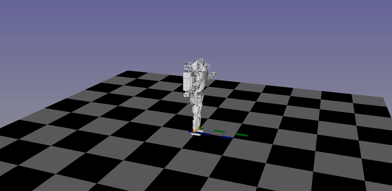

# generate-humanoid-walking-gaits

This repository shows how to follow the guidelines from Pinocchio to generate walking gaits for a humanoid robot.

## Introduction

This project is trying to implement the example from [pinocchio](https://github.com/stack-of-tasks/pinocchio) tutorial --- [**Take a walk**](https://gepettoweb.laas.fr/doc/stack-of-tasks/pinocchio/master/doxygen-html/md_doc_d-practical-exercises_6-wpg.html). I hope this project can give you a glimpse of how humanoid robot walking gaits are generated.

We chose atlas as the humanoid robot, but you can also use other humanoid models (some modifications are needed).

## Running Environment

You need to install [pinocchio](https://github.com/stack-of-tasks/pinocchio), [scipy](https://github.com/scipy/scipy), [gepetto-viewer](https://github.com/Gepetto/gepetto-viewer), matplotlib, cvxopt to run the example. The following shows how to setup the environment with conda. The order is important due to the compatibility between different packages.

```bash
conda create -n test #"test" is the name of the conda environment
conda install pinocchio -c conda-forge 
conda install -c anaconda scipy 
conda install gepetto-viewer gepetto-viewer-corba -c conda-forge 
conda install -c conda-forge matplotlib
conda install -c conda-forge cvxopt
```

## Gallery

**[Atlas Walking Gaits Generation](src/main.py)**:

 

 ## Acknowledgements

 - I learned the basics of humanoid walking from [Scaron's notes](https://scaron.info/category/robotics.html).
 - [Drake ZempPlanner Class Reference](https://drake.mit.edu/doxygen_cxx/classdrake_1_1systems_1_1controllers_1_1_zmp_planner.html).
 - Atlas URDF are copied from [PyBullet](https://github.com/bulletphysics/bullet3) with the mesh files transformed to the format of STL.
